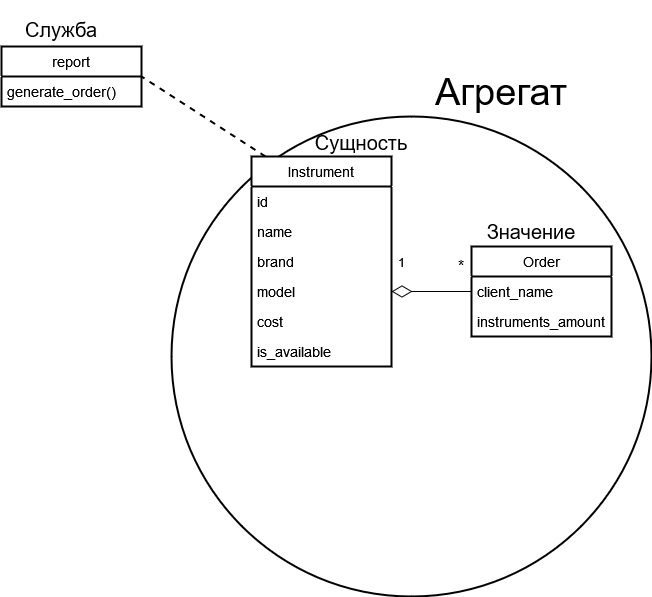

Министерство науки и высшего образования Российской Федерации  
Федеральное государственное бюджетное образовательное учреждение  
высшего образования  
«Московский государственный технический университет  
имени Н.Э. Баумана  
(национальный исследовательский университет)»  
(МГТУ им. Н.Э. Баумана)

ФАКУЛЬТЕТ ИНФОРМАТИКА И СИСТЕМЫ УПРАВЛЕНИЯ  
КАФЕДРА КОМПЬЮТЕРНЫЕ СИСТЕМЫ И СЕТИ (ИУ6)

 

ОТЧЕТ  
к лабораторной работе №4  
по дисциплине "Современные средства разработки  
программного обеспечения"  
Рефакторинг. Выделение сущностей, значений и служб модели

 

Преподаватель: Фетисов М.В.

Студент группы ИУ6-51Б Павловский Андрей Андреевич. Студент группы ИУ6-51Б Лучкин Федор Антонович. 

## Описание задания

Задача № 12: "Магазин музыкальных инструментов".

На основании информации о сделанных и выполненных заказах, а также наличии инструмента на складе, необходимо сделать заказ на пополнение склада с инструментами.

## Адрес проекта

Проект хранится в репозитории по адресу: [https://bmstu.codes/lsx/mstd/iu6-5-2021/iu6-55b-aapavlovskiy-faluchkin/lab4](https://bmstu.codes/lsx/mstd/iu6-5-2021/iu6-55b-aapavlovskiy-faluchkin/lab4).

Описание классов хранится в репозитории по адресу: [http://lsx.pages.bmstu.codes/mstd/iu6-55b-aapavlovskiy-faluchkin/lab4](http://lsx.pages.bmstu.codes/mstd/iu6-55b-aapavlovskiy-faluchkin/lab4).

## Модель предметной области "Магазин музыкальных инструментов"

Модель предметной области "Магазин музыкальных инструментов":

## Выводы

В ходе выполнения данной лабораторной работы были приобретены навыки описания модели предметной области, выполнения ее изоляции, построение диаграммы последовательности выполнения некоторого действия в приложении, а также улучшены навыки работы с внешним репозиторием кода и такими инструментами разработки как git и GitLab.
